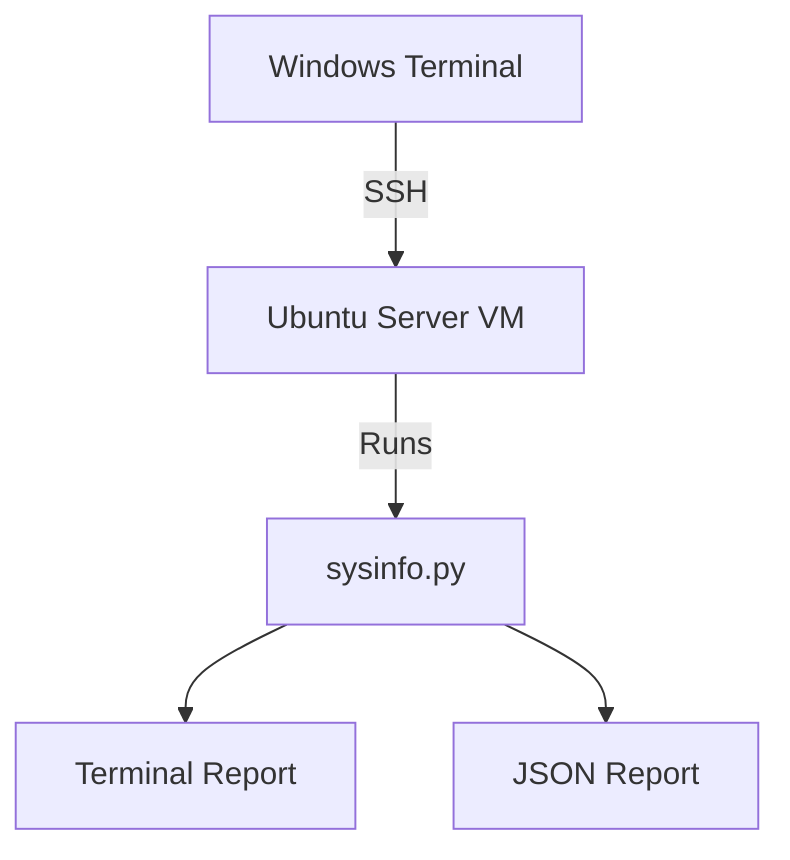
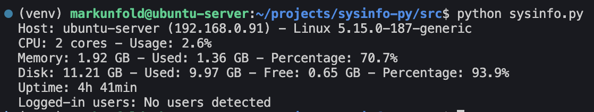
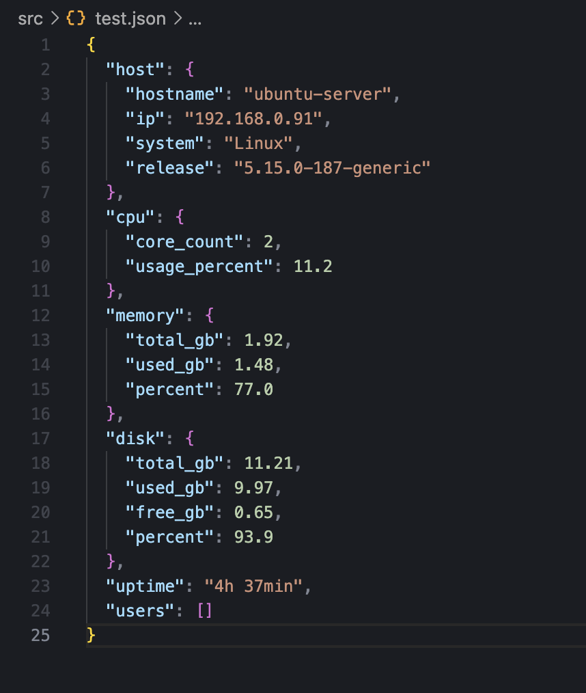

# System Info Report (Python)

Python CLI tool for collecting basic Linux system information and exporting it as JSON.

## What it is

A Python CLI tool that displays basic system information from an Ubuntu Server VM running inside a VirtualBox homelab.

## Why I built it

I built this project to practice practical Python for cybersecurity, not abstract syntax-only exercises.

This tool demonstrates foundational system inspection skills such as checking host identity, CPU usage, memory usage, disk usage, uptime, IP address detection, and logged-in users, while also exporting data to JSON for reuse.

## How it works



The script runs inside the Ubuntu Server VM through SSH access from Windows Terminal. It collects system data using Python standard libraries and psutil, then prints a formatted report or exports the same data structure to JSON.

## Project structure

```text
sysinfo-py/
├── docs/
│   ├── environment.md
│   └── screenshots/
├── examples/
│   └── report.example.json
├── src/
│   └── sysinfo.py
├── .gitignore
├── LEARNINGS.md
├── README.md
└── requirements.txt
```

## How to run

Enter the project folder:

```bash
cd sysinfo-py
```

Create and activate a virtual environment:

```bash
python3 -m venv venv
source venv/bin/activate
```

Install dependencies:

```bash
pip install -r requirements.txt
```

Run in terminal mode:

```bash
python src/sysinfo.py
```

Export default JSON report:

```bash
python src/sysinfo.py --export json
```

Export custom JSON report:

```bash
python src/sysinfo.py --export json --output test.json
```

By default, JSON output is generated as `report.json` in the current working directory.
Generated JSON files are ignored by Git. A tracked sample is available at `examples/report.example.json`.

## Output example

```text
Host: ubuntu-server (192.168.x.x) - Linux 5.15.x
CPU: 2 cores - Usage: 3.1%
Memory: 1.92 GB - Used: 1.42 GB - Percentage: 74.0%
Disk: 11.21 GB - Used: 9.97 GB - Free: 0.65 GB - Percentage: 93.9%
Uptime: 4h 33min
Logged-in users: No users detected
```

## What I learned

- How to use psutil to collect real-time system information.
- Why separating data collection from presentation improves maintainability.
- How argparse turns a script into a practical CLI utility.
- Why JSON output should keep numeric values as numbers, not formatted strings.
- How and why to use a virtual environment for reproducible execution.
- How small documentation improvements make a simple project portfolio-ready.

## Environment

Full lab setup details are documented in [docs/environment.md](docs/environment.md).

## Screenshots

### Terminal output



### JSON report output



## References

- Python documentation: https://docs.python.org/3/
- psutil documentation: https://psutil.readthedocs.io/
- argparse documentation: https://docs.python.org/3/library/argparse.html
- Ubuntu Server documentation: https://ubuntu.com/server/docs
- VirtualBox documentation: https://www.virtualbox.org/manual/
